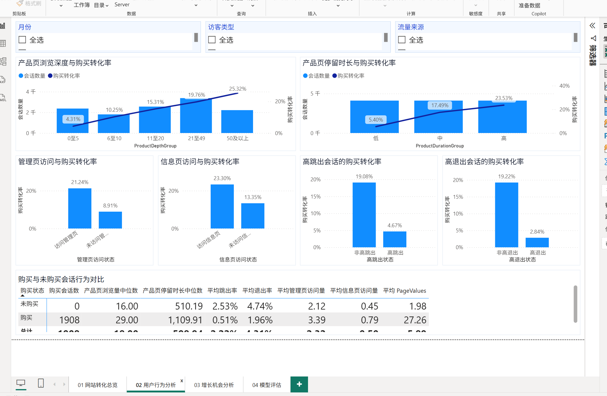
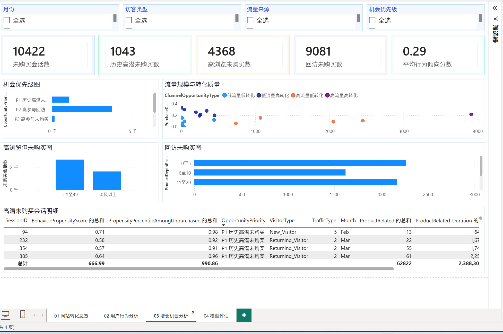

# 电商网站用户行为与购买转化分析

## 项目概述

本项目围绕电商网站访问会话，分析哪些行为与购买转化相关，识别值得优先优化的流量来源和未购买会话类型，并构建会话购买倾向排序模型。

项目面向电商产品经理、用户增长负责人、网站运营负责人和产品数据分析师，交付物包括：数据质量报告、派生字段、探索性分析、统计检验、购买倾向模型、MySQL 数据层和 Power BI 看板。

> **作品集定位：** 使用 Python、MySQL 和 Power BI 搭建会话级转化分析流程，将 12,330 条访问会话转化为可执行的渠道优化、页面行为诊断和高潜未购买会话排序建议。

## 看板预览

| 用户行为分析 | 增长机会分析 |
| --- | --- |
|  |  |

完整 Power BI 看板共 4 页：网站转化总览、用户行为分析、增长机会分析和模型评估。页面指标和图表均随月份、访客类型、流量来源等筛选条件联动。

## 核心业务问题

- 网站整体会话购买转化率是多少？
- 新访客、回访访客会话的转化表现有何差异？
- 哪些流量来源具有较高转化质量，哪些属于高流量低转化来源？
- 产品页浏览量、停留时长、跳出率和退出率与购买有何关联？
- 周末、工作日及不同月份的样本表现是否不同？
- 哪些未购买会话更接近购买，产品和增长团队应优先优化什么？

## 数据与分析边界

原始数据为 [UCI Online Shoppers Purchasing Intention](https://archive.ics.uci.edu/dataset/468/online+shoppers+purchasing+intention+dataset) 数据集，一行代表一个网站访问会话。

| 项目 | 说明 |
| --- | --- |
| 样本量 | 12,330 个会话 |
| 原始字段 | 18 个 |
| 购买会话 | 1,908 个 |
| 整体会话购买转化率 | 15.47% |
| 数据粒度 | 会话级，不是用户级 |
| `SessionID` | 从 1 开始的行编号，仅用于定位会话记录 |

因此，本项目可以进行会话转化、访客类型、流量来源、页面行为和购买倾向分析；不能声称完成用户留存、复购、LTV、Cohort、跨会话路径或完整浏览至支付漏斗分析。

`TrafficType`、`Browser`、`OperatingSystems` 和 `Region` 均为原始类别编码。没有映射表时，只比较编号表现，不擅自解释为具体渠道或地区。

## 主要结论

- 高退出会话的转化率仅为 **2.84%**，显著低于非高退出会话的 **19.22%**；退出率是排除 `PageValues` 后区分购买与未购买会话最强的行为变量。
- 产品页浏览深度由 `0至5` 增至 `50及以上` 时，观察到的转化率由 **4.31%** 上升至 **25.32%**；产品页停留时长由低到高时，转化率由 **5.40%** 上升至 **23.53%**。
- 新访客会话转化率为 **24.91%**，回访访客会话为 **13.93%**；但回访访客会话占全部样本 **85.57%**，仍是主要优化对象。
- `TrafficType 1`、`3`、`13` 为高流量低转化来源，优先检查落地页一致性、浏览深度和退出表现；`TrafficType 2` 可作为高流量高转化对照组。
- 周末转化率为 **17.40%**，高于工作日的 **14.89%**，但统计关联强度可忽略，不宜单独据此重配运营资源。
- 排除 `PageValues` 的会话行为模型在留出测试集 Top 10% 会话中达到 **42.51%** 实际转化率，为整体平均水平的 **2.74 倍**，适合用于会话优先级排序。

详细业务建议见 [08_最终业务结论.md](08_最终业务结论.md)。

## 项目结构

```text
电商网站用户行为与购买转化分析/
├── assets/screenshots/                       # 作品集使用的 Power BI 看板预览
├── data/processed/
│   └── online_shoppers_cleaned_base.csv     # 清洗后基础数据
├── online_shoppers_intention.csv            # UCI 原始数据
├── online_shoppers_analysis_ready_v2.csv    # 含派生字段的分析主数据
├── 01_分析口径说明.md                       # 指标口径和项目边界
├── 02_数据检查与清洗.py
├── 02_数据质量报告.md
├── 03_字段工程.py
├── 03_派生字段说明.md
├── 04_探索性分析.py
├── 04_探索性分析报告.md
├── 05_统计检验.py
├── 05_统计检验报告.md
├── 06_购买倾向建模.py
├── 06_购买倾向模型报告.md
├── 06_模型评估增强.py
├── 06_模型评估补充报告.md
├── 07_MySQL数据层.py
├── 07_MySQL数据层说明.md
├── 08_最终业务结论.md
├── outputs/                                 # EDA、统计检验和模型评估结果
├── sql/                                     # MySQL 建表、视图与核验 SQL
├── 电商power.pbix                           # 原始 Power BI 报表
└── 电商power_优化版.pbip                    # 可编辑的 Power BI 项目副本
```

## 分析流程

| 阶段 | 脚本或文档 | 产出 |
| --- | --- | --- |
| 1. 口径定义 | `01_分析口径说明.md` | 明确会话级范围、指标和限制 |
| 2. 数据检查与清洗 | `02_数据检查与清洗.py` | `data/processed/online_shoppers_cleaned_base.csv` |
| 3. 字段工程 | `03_字段工程.py` | `online_shoppers_analysis_ready_v2.csv` |
| 4. 探索性分析 | `04_探索性分析.py` | `outputs/eda/` 与探索性分析报告 |
| 5. 统计检验 | `05_统计检验.py` | `outputs/statistics/` 与统计检验报告 |
| 6. 倾向建模 | `06_购买倾向建模.py` | 基础模型、特征重要性、预测结果 |
| 7. 模型增强评估 | `06_模型评估增强.py` | 样本外评分、Lift、置信区间、校准诊断 |
| 8. MySQL 数据层 | `07_MySQL数据层.py` | 会话事实表、模型表和 Power BI 视图 |
| 9. 看板与结论 | Power BI、`08_最终业务结论.md` | 管理层可读的业务洞察 |

## 运行说明

### 1. Python 环境

建议使用 Python 3.10 或更高版本。模型依赖安装：

```powershell
python -m pip install -r requirements-model.txt
```

从项目根目录按顺序运行：

```powershell
python 02_数据检查与清洗.py
python 03_字段工程.py
python 04_探索性分析.py
python 05_统计检验.py
python 06_购买倾向建模.py
python 06_模型评估增强.py
```

脚本输出位于：

- `outputs/eda/`：整体指标、分组表现、流量来源和机会会话。
- `outputs/statistics/`：卡方检验、Cramer's V、Mann-Whitney U 与效应量。
- `outputs/models/`：模型指标、特征重要性和混淆矩阵；可重新训练的 `.joblib` 模型文件不纳入版本控制。
- `outputs/models/enhanced_evaluation/`：样本外评分、Lift、触达档位、置信区间、校准诊断。

### 2. 模型使用边界

模型以会话购买倾向排序为目的，类别不平衡下不只看准确率，而使用 Precision、Recall、F1、ROC-AUC 和 PR-AUC 共同评价。

- **排除 `PageValues` 的会话行为模型**：用于分析和排序，但仍使用整段会话聚合行为，不能直接称为实时早期干预模型。
- **包含 `PageValues` 的模型**：只作为回顾性性能基准。`PageValues` 可能在临近交易时才形成，未确认字段生成时点前不得用于部署或营销触达。
- 历史会话优先使用样本外分数 `BehaviorExclPageValuesOutOfSampleScore`，不使用训练内拟合分数来证明历史 Lift。

### 3. MySQL 数据层

安装 MySQL Python 驱动：

```powershell
python -m pip install -r requirements-sql.txt
```

装载数据：

```powershell
python 07_MySQL数据层.py --user root
```

脚本会交互式请求 MySQL 密码，不会将密码写入项目文件。默认数据库为 `online_shoppers_analytics`。主要视图包括：

- `vw_session_analysis`：Power BI 会话主分析表。
- `vw_traffic_performance`：流量规模、转化率和高流量低转化标签。
- `vw_growth_opportunities`：未购买会话及 P1-P5 机会优先级。
- `vw_conversion_overview`、`vw_month_performance`、`vw_weekend_performance`：核心 KPI 与趋势分析。

具体连接和核验步骤见 [07_MySQL数据层说明.md](07_MySQL数据层说明.md)。

### 4. Power BI

Power BI 主表建议连接 MySQL 视图 `vw_session_analysis`，使用 Import 模式。模型页还需要导入：

- `model_evaluation`
- `model_operating_points`
- `model_decile_lift`
- `model_metric_ci`
- `model_feature_availability`

字段排序要求：

- `Month` 按 `MonthOrder` 排序。
- `ProductDepthGroup` 按 `ProductDepthOrder` 排序。
- `ProductDurationGroup` 按 `ProductDurationOrder` 排序。

原始报表为 `电商power.pbix`；可编辑优化版为 `电商power_优化版.pbip`。

## 方法说明

- 分类变量与购买：Pearson 卡方检验与 Cramer's V。
- 行为变量与购买：Mann-Whitney U 检验与秩二列相关。
- 多重检验：Benjamini-Hochberg 校正。
- 倾向模型：逻辑回归、决策树、随机森林；使用分层交叉验证和留出测试集。
- 排序效果：样本外/留出集 Lift、Top-K 触达档位和累计转化捕获。

## 数据限制与后续建议

- 数据没有真实用户 ID，不能开展留存、复购、用户生命周期价值或跨会话路径分析。
- 数据没有逐条点击事件、加购、结算或支付事件，不能还原完整转化漏斗。
- 数据没有订单金额、商品明细、渠道名称和获客成本，不能计算 GMV、客单价、商品表现或渠道 ROI。
- 月份缺少完整年度和年份信息，只能描述样本期月份差异，不能证实长期季节性。
- 当前模型采用随机分层验证；获得新时间段数据后，应增加严格的时间外验证。

后续优先补充匿名用户 ID、会话时间戳、事件序列、渠道名称及成本、商品/品类、加购和结算事件、订单金额，用于验证优化动作是否真正带来增量购买。
